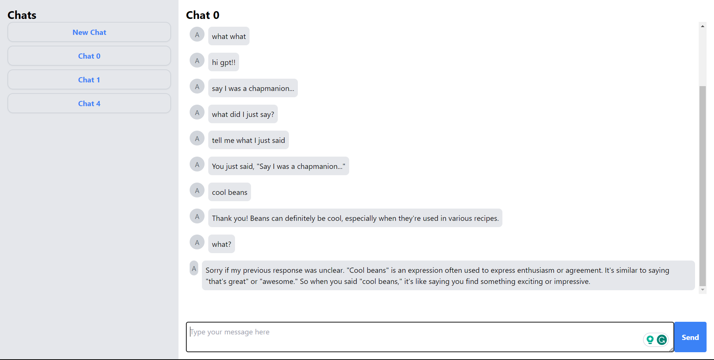

# Rust HTMX Example

This is the start of a ai chat ui using [htmx](https://htmx.org/) and [rust](https://www.rust-lang.org/). It saves the chats in local storage and uses askama to render the html.

